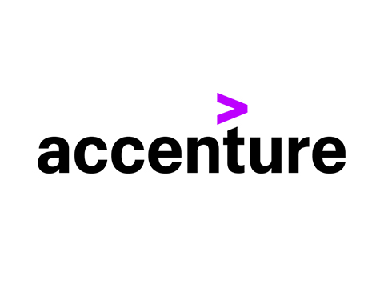

# Accenture Stock History Analysis (2019-2021)

## Project Description:
Uncovering the Insights Within Accenture's Financial Tapestry 

With my thorough data analysis project, which covers the stock history over the last three years (2019, 2020, 2021), take a fascinating trip through Accenture's financial story. Our dataset, sourced from Kaggle, provides investors, analysts, and enthusiasts with a nuanced perspective by revealing the finer points of Accenture's market performance.
