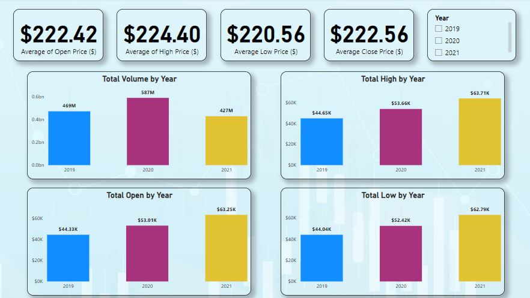

# Accenture Stock History Analysis (2019-2021)

## Overview:
Explore the dynamic world of Accenture stock with my comprehensive data analysis project covering the stock history from 2019 to 2021. Leveraging a dataset sourced from Kaggle, I delve into key metrics, unveil trends, and employ forecasting techniques for a deeper understanding of Accenture's market performance.  

The dataset (CSV file) for this analysis is attached and the workspace used is **Power BI** 

## Analysis Highlights:

### 1- Forecasting with Excel:
Applying forecasting formulas in Microsoft Excel, I project the stock's trajectory for the next 30 days, specifically targeting October 2021. This forward-looking approach utilizes historical data patterns to make informed predictions, aiding investors and analysts in making strategic decisions.

### 2- Bar Chart Analysis: 
Visualizing the total volume, high, low, and open prices for Accenture from 2019 to 2021 provides a clear snapshot of stock trends. Bar charts effectively illustrate the yearly fluctuations in these key parameters.

### 3- Average Price Analysis:
Calculating the annual averages for open, high, low, and close prices further refines my analysis. This allows us to identify patterns, potential anomalies, and gain a nuanced understanding of the stock's overall performance in each respective year.

# Dashboard

## key Insights:
- **Average Prices:** The open, high, low, and close prices remained fairly stable over the years, with averages around $220–$224.
- **Trading Volume:** There was a significant spike in volume in 2020 (587M), followed by a decline in 2021 (427M).
- **Price Trends:** Both the highest and lowest prices increased in 2021, indicating growing market volatility.

## Recommendation:
Monitor future price movements closely, as increasing price volatility in 2021 could signal further fluctuations, while the decline in trading volume may suggest reduced market participation or interest.

## Significance:
My analysis goes beyond merely presenting data; it empowers investors, analysts, and enthusiasts with actionable insights. By unraveling historical trends and providing forecasts, I contribute valuable information for informed decision-making in the complex landscape of stock investments.

## Takeaway:
Discover the complex variables that have shaped Accenture's stock performance over the last three years to gain a tactical edge in the financial markets. This project not only provides a retrospective study but also equips you with the ability to predict future trends, helping you stay ahead in the ever-changing stock market.

